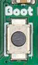
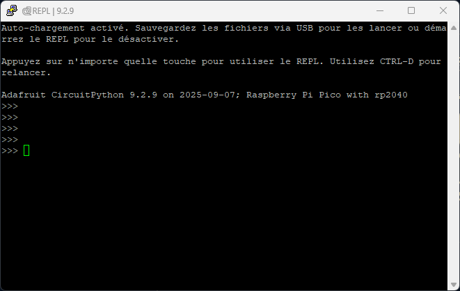

# Maintenance – Carte Entrées/Sorties Stocker 7500
## Présentation des cartes
Les nouvelles Cartes Entrées/Sorties des Stockers sont conçues pour permettre une maintenance simple et rapide.

Équipées d’un microcontrôleur Raspberry RP2350, elles intègrent, grâce à CircuitPython, 
une interface avec laquelle vous pouvez directement interagir afin d’obtenir des informations ou piloter les composants de la carte.

## Première Utilisation

Lors de sa première utilisation, la carte n’est pas *flashée* : 
elle ne dispose pas encore du code nécessaire à son bon fonctionnement. Il faut donc la programmer.

La procédure dépend du modèle de votre Carte Entrées/Sorties, celui-ci est précisé sur le nom en haut à droite de la carte :

- Choisissez la catégorie [**Prototype**](#prototype) si le nom possède la mention *prototype*.  
- Choisissez la catégorie [**Finale**](#finale) si le nom ne possède aucune mention particulière.

### Prototype

La version prototype utilise une carte de développement. 
Il faut donc supprimer la version de test de CircuitPython déjà présente et la reflasher.

Matériel nécessaire :  
- Le fichier UF2 [*Nuke*](https://github.com/Gadgetoid/pico-universal-flash-nuke/releases/latest) permettant d’effacer entièrement la mémoire flash de la carte de développement.
- Le fichier UF2 de [*CircuitPython*](https://circuitpython.org/board/solderparty_rp2350_stamp_xl/) correspondant à la version de la carte de développement, RP2350 Stamp XL.
- Les fichiers [*code.py*](code/code.py) et [*repl.py*](code/repl.py) trouvables dans le dossier [code](code) du projet.
- Un câble **USB A mâle–mâle** pour relier la carte à l’ordinateur.  

Procédure (sur table, carte non branchée au Stocker) :  
1. Maintenez appuyé le bouton **BOOTSEL** de la carte et connectez-la à l’ordinateur.  
  
2. Si l’opération est réussie, un support nommé `RPI-RP2` apparaît dans l’explorateur de fichiers. 
Si vous ne voyez que `CIRCUITPY` ou rien du tout, recommencez.  
3. Copiez le fichier [*Nuke*](https://github.com/Gadgetoid/pico-universal-flash-nuke/releases/latest) dans `RPI-RP2`. Le support se ferme automatiquement. 
Débranchez puis répétez la procédure, cette fois avec le fichier de [*CircuitPython*](https://circuitpython.org/board/solderparty_rp2350_stamp_xl/).  
4. Rebranchez : vous devez maintenant voir apparaître `CIRCUITPY`. Si ce n’est pas le cas, recommencez.  
5. Copiez [*code.py*](code/code.py) et [*repl.py*](code/repl.py) à la racine de `CIRCUITPY`. Acceptez l’écrasement des fichiers existants.  

***Votre carte est désormais flashée et prête à l’emploi !***

### Finale

La version finale utilise directement le microcontrôleur. 
Il faut donc flasher une version personnalisée de CircuitPython.

Matériel nécessaire :  
- Le fichier UF2 [*firmware.uf2*](circuitpython/firmware.uf2), disponible dans le dossier [*circuitpython*](circuitpython) du projet.
- Les fichiers [*code.py*](code/code.py) et [*repl.py*](code/repl.py) trouvables dans le dossier [code](code) du projet.
- Un câble Dupont (ou équivalent) pour faire contact.
- Un câble **USB A mâle – MicroUSB mâle** pour relier la carte à l’ordinateur.  

Procédure (sur table, carte non branchée au Stocker) :  
1. Reliez le **via BOOTSEL** de la carte à la masse, puis connectez la carte à l’ordinateur.  
2. Si l’opération est réussie, un support nommé `RPI-RP2` apparaît dans l’explorateur de fichiers. 
Si vous ne voyez que `CIRCUITPY` ou rien du tout, recommencez.  
3. Copiez le fichier [*firmware.uf2*](circuitpython/firmware.uf2) dans `RPI-RP2`. Le support se ferme automatiquement.  
4. Rebranchez : vous devez maintenant voir apparaître `CIRCUITPY`. Si ce n’est pas le cas, recommencez.  
5. Copiez [*code.py*](code/code.py) et [*repl.py*](code/repl.py) à la racine de `CIRCUITPY`. Acceptez l’écrasement des fichiers existants.  

***Votre carte est désormais flashée et prête à l’emploi !***

## Communication avec la carte

Pour communiquer avec la carte, un logiciel de communication série est nécessaire. 
Celui que j’utilise, et dont je vais détailler la procédure, est **PuTTY**, mais il existe de nombreuses alternatives dont l’utilisation reste similaire.

- Téléchargez le logiciel [*PuTTY*](https://www.chiark.greenend.org.uk/~sgtatham/putty/latest.html).  
Il est normalement préinstallé sur la plupart des ordinateurs de la fab. 
Dans le cas contraire, une version portable est disponible à [ce lien](https://portableapps.com/apps/internet/putty_portable).  
- Connectez-vous au port micro-USB ou USB-A de la carte, puis ouvrez le **Gestionnaire de périphériques**.   
- Vous devriez y voir un périphérique nommé `USB Serial Device` suivi d’un port COM.  
	* Si ce n’est pas le cas, débranchez puis rebranchez la carte
	* Si le problème persiste, suivez la procédure de [première utilisation](#premiere-utilisation)  
- Lancez PuTTY. Dans la catégorie `Session` :
	* sélectionnez l’option `Serial`  
	* entrez le port (COM\#) dans le champ `Serial line`  
- Cliquez sur `Open ». Si une fenêtre similaire à celle-ci apparaît :  
    
***Félicitation ! Vous êtes dans la console de votre carte.***

##Utilitaires
Voici une listes des différents utilitaires et de leurs fonctions :

| Nom        | Fonction                                                                 | Appel                                                                                           |
|------------|---------------------------------------------------------------------------|-------------------------------------------------------------------------------------------------|
| printdict  | Retourne l’entièreté des tableaux des entrées/sorties avec leur correspondance | `printdict()`                                                                                   |
| sigdef     | Définition des entrées signaux de l’ordinateur                           | `sigdef()`                                                                                      |
| sensdef    | Définition des entrées capteurs des Entrées/Sorties                      | `sensdef()`                                                                                     |
| motdef     | Définition des sorties moteurs et solénoïdes des Entrées/Sorties         | `motdef()`                                                                                      |
| pindef     | Définition manuelle d’un signal en tant qu’entrée ou sortie              | `pindef([nom de signal], ["IN" ou "OUT"])`                                                      |
| sigread    | Affiche la valeur de tous les signaux                                    | `sigread()`                                                                                     |
| testsig    | Lecture de la valeur d’un signal donné                                   | `testsig([nom de signal])`                                                                      |
| sensread   | Affiche la valeur de tous les capteurs                                   | `sensread()`                                                                                    |
| testsens   | Lecture de la valeur d’un capteur donné                                  | `testsens([nom de capteur])`                                                                    |
| motor_test | Permet de contrôler un moteur ou un solénoïde selon commande (vitesse/état) | `motor_test(["MotS", "MotE", "SoleL" ou "SoleR"], ["high", "low" ou "stop"])`                   |
| testpins   | Affiche la valeur de tous les signaux et capteurs                        | `testpins()`                                                                                    |
| testrun    | Procédure de test de la boucle principale (simulation du main)           | `testrun()`                                                                                     |

**Note :** Les signaux doivent être initialisés avant d’être utilisés et chaque signal ne peut être initialisé qu’une seule fois.  
Pour désinitialiser, rechargez la carte avec `CTRL+R`.

## To Do

- [x] Recompiler circuitpython avec le build custom
- [x] Réparer le README.md (photos et liens)
- [ ] Ecrire un README.md pour la compilation de circuitpython
- [ ] Inclure fichiers hardware de la carte (prototype et finale)
- [ ] Re-router la nouvelle version
- [ ] Ajouter une section "troubleshooting
- [ ] etc...